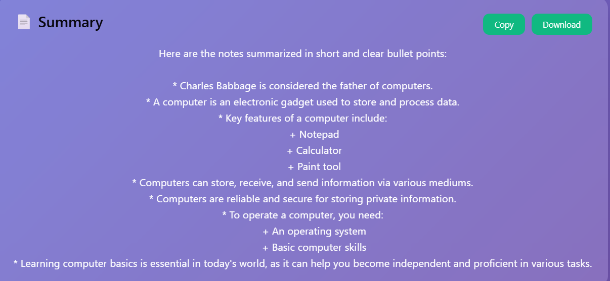
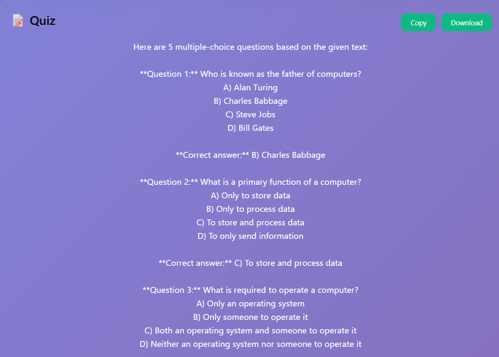
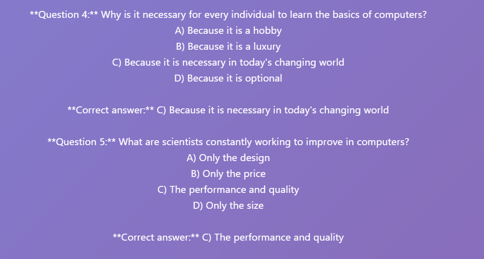
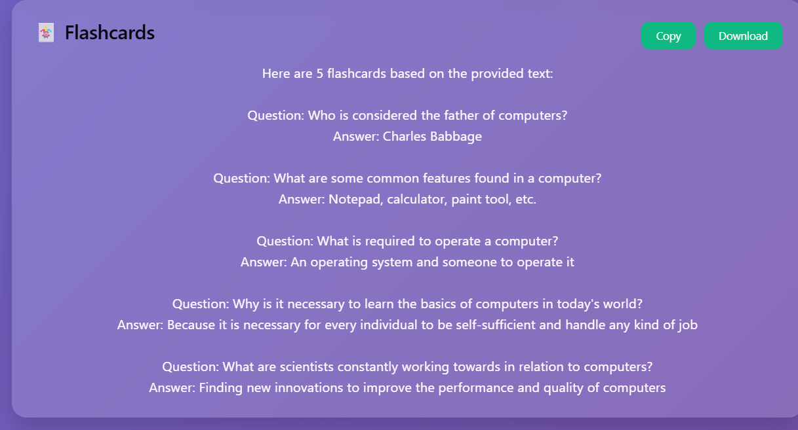
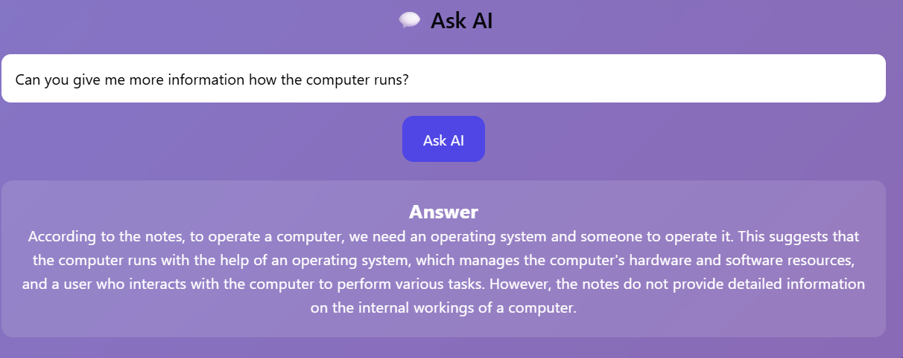

# 📚 AI Study Buddy

An AI-powered study assistant that helps students learn smarter by generating summaries, quizzes, flashcards, and answering questions from study notes.

---
## 🌐 Live Demo

https://ai-study-buddy-flame.vercel.app/

## ✨ Features

- 📄 AI Summary Generator
- 📝 AI Quiz Generator
- 🃏 AI Flashcards
- 💬 Ask AI About Your Notes
- 📋 Copy Results
- ⬇️ Download Results
- 🎨 Modern Responsive UI

---

## 🛠️ Tech Stack

- React
- Vite
- JavaScript
- Groq AI API
- HTML5
- CSS3

---

## 📸 Screenshots

### 🏠 Home Page


### 📄 AI Summary



### 📝 AI Quiz




### 🃏 AI Flashcards



### 💬 Ask AI



---

## 🚀 Installation

Clone the repository

```bash
git clone https://github.com/vaishnavidesai366-hub/AI-Study-Buddy.git
```

Go into the project

```bash
cd AI-Study-Buddy
```

Install dependencies

```bash
npm install
```

Create a `.env` file

```env
VITE_GROQ_API_KEY=your_api_key_here
```

Start the development server

```bash
npm run dev
```

---

## 📂 Project Structure

```
src/
│
├── assets/
├── services/
│   └── groq.js
├── App.jsx
├── App.css
├── main.jsx
```

---

## 🌟 Future Improvements

- PDF Upload
- Dark Mode
- Multiple Languages
- Voice Assistant
- Study Progress Tracker
- AI Mind Maps

---

## 👩‍💻 Developer

**Vaishnavi Desai**

First Year Electronics & Communication Engineering Student

Built using ❤️ with React and Groq AI.